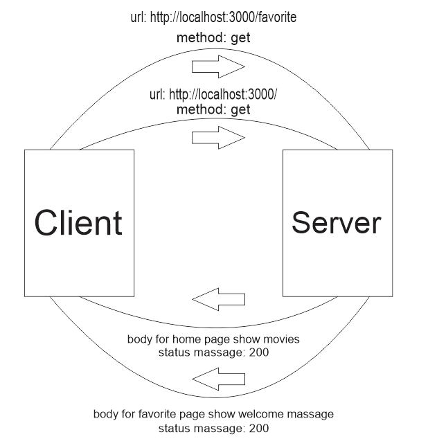

# Movies-Library - Version 1.0.0

**Author Name**: Hasan Alrawaqa

## WRRC

## Overview:
this project for movies website to show the latest movies relased

## Getting Started
### 1- Bulid server
- Firstly,use npm init -y in terminal to make a default packagr.json 
- Secondly, make a server.js file to bulid server and change the main in  package.json to the same name for this file
- Thirdly, in terminal use "npm  npm install express"
- in server.js start bulid server using this code:{
    const express = require('express')
const app = express()
const port = 3000
app.listen(port, () => {
  console.log(`Example app listening on port ${port}`)
})
-  make a home page response
- make favorite page response

}

## Project Features
 - the project has home page: (./) with response show information for movie title and poster_path and overview.
 - the project has a favorite page : (/favorite) with response show massage: Welcome to Favorite Page

 ## lab12:
 - add trending route to site using 3rd party API
 - add search route to site using 3rd party API
 - using cors() and dotnev